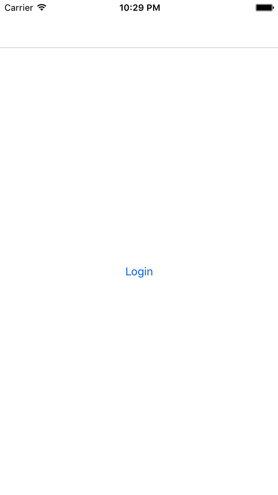
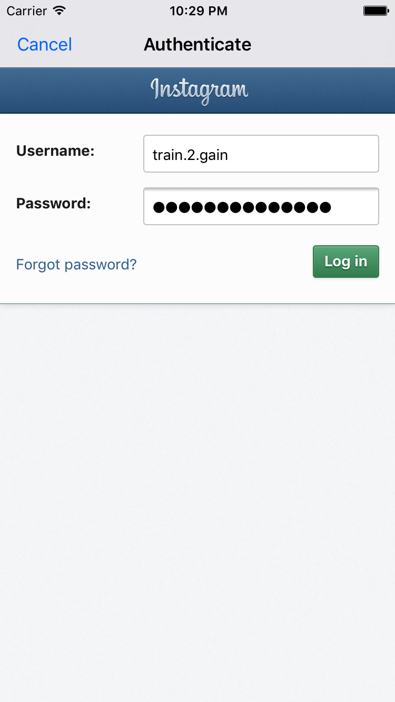

# Instagram-API-Xamarin
A project in Xamarin which allows you to login on Instagram and get data from the endpoints of the Instagram API.

# Screenshots

  

# Documentation

## What's included
With this project you have a template to start with, when you want to work with the Instagram API in Xamarin.
You get:
* A class to handle the authentication.
* A class to access the endpoints of the Instagram API.
* Container classes which transform the JSON responses of the endpoints into objects.
* Code snippets which show you how you can access the endpoints, transform the JSON responses and access the transformed object members.
* A small App which shows you what you can do with this project.

<!-- You can also find the classes as NuGet package! Just follow the link in the helpful link section. -->

## How to use it
It's pretty easy to use the project. First you have to create a developer account on Instagram and then you can create a new set of client credentials for your app. After that open the "Constants" class in the Instagram API folder and insert the data of your client in the following lines.
```c#
// Your client id. You get it from your registered client on Instagram. (https://www.instagram.com/developer/clients/manage/)
public static string ClientId =  "eefbf801250e4611880cbf07417ef780";

// Specify what you want to access from the Instagram API. I didn't use all of them in this example.
// For more scope parameters look at the Instagram API documentation. (https://www.instagram.com/developer/authorization/)
public static string Scopes = "basic public_content likes";

// The authorization URL of Instagram. Note that I use client-side authentication in this example.
// Change the response_type to "code" to use server-side authentication. (https://www.instagram.com/developer/authentication/)
// Don't forget to insert your client_id and redirect_uri in the url.
public static string AuthorizationUrl = "https://api.instagram.com/oauth/authorize/?client_id=eefbf801250e4611880cbf07417ef780&redirect_uri=https://localhost:3000/callback&response_type=token";

// Your redirect URI. The URI must match with the registered redirect URI of your Instagram client. (https://www.instagram.com/developer/clients/manage/)
public static string RedirectUri = "https://localhost:3000/callback";
```
And that's it! Just run the project and everything works with your data! Please take also a look at the notes, since they are quite important.

## Helpful Links
* Xamarin Authentication: <br>
  https://developer.xamarin.com/guides/xamarin-forms/cloud-services/authentication/oauth/
* Instagram Developer website: <br>
  https://www.instagram.com/developer/
<!--* NuGet Package of the Instagram API classes: <br>
  https://www.nuget.org/packages/Temper.InstagramAPIXamarin.InstagramAPI?NormalizedVersion=1.0.0 -->

## Notes
* The project runs on Windows Visual Studio. I tried to use it with Xamarin Studio und Visual Studio for Mac, but there occurred errors. But you can still use the whole code, just copy the Instagram API folder to your project and add the OAuthLoginPresenter to your project as describen in the InstagramAuthenticator class.
* I didn't use all scope parameters and endpoints in this project, but when you take a look at the Instagram API class you can see how you can access endpoints.
* The project uses client-side authentication.
* The tasks in the project are not async!
* The project is well documented. Please take a look at the code for further information.
* Please share the project if it helped you, so that others also don't have to spend hours to setup the communication with Instagram!
